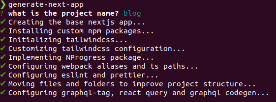

# generate-next-app 
_work in progress_

Just a wrapper on top of create-next-app cli to create nextjs applications with my own custom packages and configurations.
This CLI creates a custom nextjs app with the following features:
* Graphql support integrated with react-query and Graphql Codegen
* TailwindCSS with a custom configuration and optimization.
* Nprogress integrated to improve ux in page transitions
* Prettier formatter integrated with eslint
* Jest integrated with @testing-library
* Cypress Setup
* Webpack alias and ts-paths
* Webpack Bundle analyzer

## Requeriments
* node version > 12.20

## Usage
### Install
npm:
> npm install -g generate-next-app

yarn
> yarn global add generate-next-app

### Create a next app
> generate-next-app

Give it the project name and it will generate and configurate your nextjs application automatically

You can use the additional argvs to customize the tech stack.
* --debug: Log detailts about each command and step that is running.